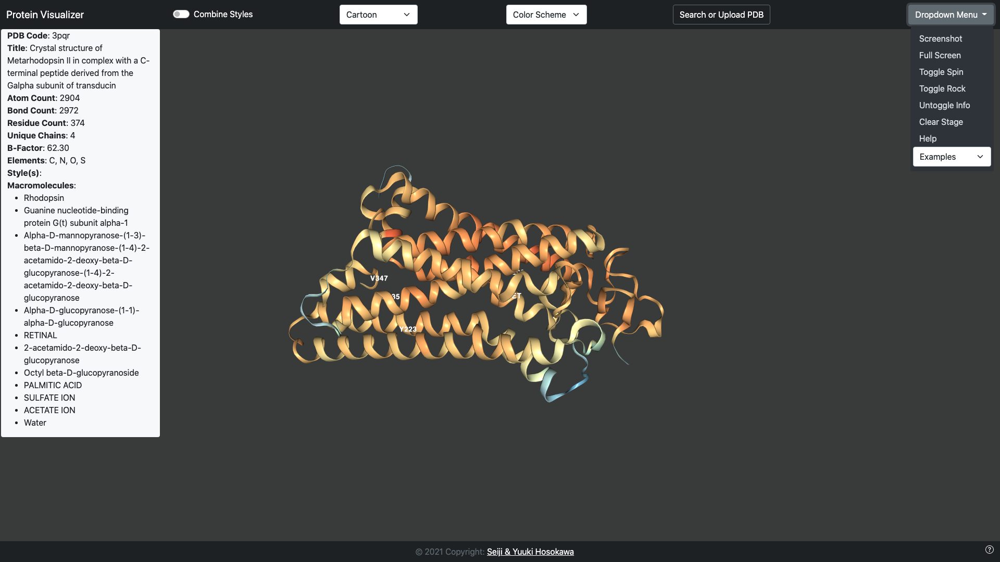

# Protein Visualizer
A 3D Protein Visualization tool built using WebGL and Javascript. This web application allows you to view 3 dimensional protein structures in a variety 
of representations and color schemes to fit your needs. 

We aimed to make it as user friendly as possible so please read the instructions below and enjoy!

[Click here to use the tool](https://seijihosokawa.github.io/proteinVisualizer/)

## Description of each feature:
  * Viewing Stage: 
    * Click and drag using the mouse to move the protein around and use the scroll wheel to zoom in and out
    * Hover over different sections of the protein to see atom information
  * Combine Styles Switch:
    * Turn the switch on to combine different styles, the style will be added with the selected color scheme
  * Protein Style Dropdown:
    * Select a molecular representation
      * Cartoon: Secondary structure abstraction
      * Backbone: Backbone atom trace
      * Ball & Stick: Cylinders and spheres for bonds and atoms
      * Line: Simple lines for bonds
      * Spacefill: Space-filling spheres for atoms
      * Surface: Displays the molecular surface and may take time to load
    * [Click here for a more detailed description on molecular representations](https://nglviewer.org/ngl/api/manual/usage/molecular-representations.html)
  * Color Schemes:
    * [Click here for a more detailed description on color schemes](https://nglviewer.org/ngl/api/manual/usage/coloring.html#selection-based-coloring)
  * Search or Upload PDB:
    * Click here if you have your own file you would like to be visualized
    * You can search through a list of PDB codes we have provided using the search bar
    * Or if you know the PDB code, write it into the search bar and click select, the corresponding protein will be loaded onto the stage
  * Dropdown Menu:
    * Screenshot
      * This button allows you to take a screenshot of the current protein, it does not include the info box and will be named as the protein "pdbcode.png"
    * Full Screen
      * This button allows you to get rid of our nav bar and footer and experience the protein in a full screen, press <kbd>ESC</kbd> to exit full screen
    * Center Protein 
      * This button centers the protein in case you lose the angle you began with
    * Toggle Spin
      * Toggle/Untoggles the protein spinning around y-axis
    * Toggle Rock
      * Toggle/Untoggles the protein rocking around y-axis
    * Untoggle Info
      * Toggle/Untoggles the info box, it is by default toggled on
    * Clear Stage
      * Clears the stage of all molecular structures and clears info box
    * Help
      * Links to this page, our instructions
    * Examples
      * Here we have provided a few examples of interesting and important proteins, enjoy
  * Info Box:
    * The info box as a plethoral of information at your disposal and will update once you have selected a new protein
  * Question/Help button in bottom right:
    * Please click here if you need additional help or would like to submit questions/issues

References:
  * https://getbootstrap.com/docs/4.5/getting-started/introduction/
  * https://www.rcsb.org/
  * http://nglviewer.org/ngl/api/class/src/stage/stage.js~Stage.html
  * https://www.w3schools.com/howto/howto_js_draggable.asp

